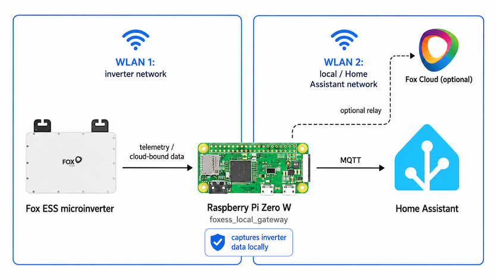
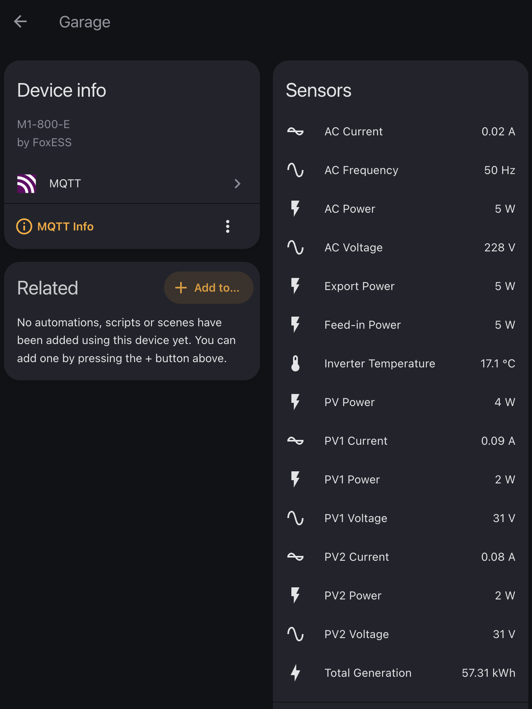
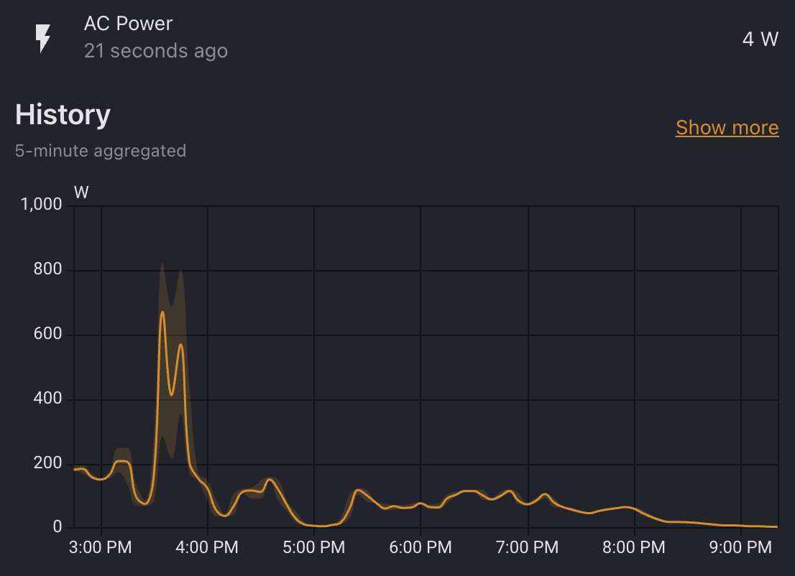

# FoxESS M1 Local Gateway

A Raspberry Pi gateway for FoxESS M1 (and potentially Q1) microinverters.
Provisions inverters directly over Bluetooth, decodes their local
telemetry, and publishes it to MQTT with Home Assistant auto-discovery —
the FoxESS app and cloud are not needed at any point.



## Why Use This

- Writable `Active Power Limit` slider in Home Assistant for
  curtailment during negative electricity prices or demand-charge avoidance (German
  Nulleinspeisung).
- No data leaves your network, including during initial setup — the Pi can
  provision the inverter directly over Bluetooth, so the FoxCloud mobile
  app is optional.
- Continue using your inverter even if the FoxESS cloud changes, is offline or gets disabled.
- Optional relay mode to the Fox ESS cloud is supported.
- MQTT auto discovery creates Home Assistant sensors automatically, neatly bundled into one
  device per inverter.
- No Home Assistant HACS Add-ons needed
- Works with multiple inverters connected through the Pi AP at the same time, even if they use
  their own mesh network.

## What This Does

The Raspberry Pi runs four pieces:

- `hostapd`/`dnsmasq` for an inverter-only Wi-Fi AP.
- A narrow nftables redirect for TCP/14431 traffic from the inverter AP subnet.
- `foxess-local-cloud`, a Python daemon that decodes the inverter's pushed
  telemetry, publishes MQTT state, and (when *Inverter Control* is enabled)
  drives the writable `Active Power Limit` slider directly over local
  Modbus, bypassing the FoxESS cloud.
- `foxess-ble-provision`, a Bluetooth tool that points inverters at the AP
  during setup, so the FoxESS mobile app isn't needed.

## Screenshots





## What You need
- A Raspberry Pi (old Zero W is fine) in reception range of your inverter(s) and your home wifi
- A recent wifi-only Fox ESS Solar inverter, e.g.
  - M1-600-E
  - M1-800-E
  - M1-1000-E
  - M1-1200-E
  - Q1-1600-E (not confirmed)
  - Q1-2000-E (not confirmed)
  - Q1-2400-E (not confirmed)
  - Q1-2500-E (not confirmed)
- Home Assistant with the Mosquitto Broker app

## Tested

Tested:

- Raspberry Pi Zero W running Raspberry Pi OS Lite (Trixie).
- FoxESS M1-800-E microinverter.
- M1 two-string PV telemetry:
  - PV power, voltage, and current for PV1/PV2.
  - AC power, voltage, current, and frequency.
  - Inverter temperature.
  - Lifetime generation and lifetime grid export.
  - Operating state (running/idle/fault) and fault state, with the
    last fault's code, message, and timestamp.
  - Firmware and hardware versions decoded from the module-info frame.
  - Mesh role (root or follower) and — for followers — the root
    inverter's serial, derived from the periodic role-declaration
    frames the firmware emits.
- MQTT retain and Home Assistant MQTT discovery.
- Optional cloud relay mode while still decoding local telemetry.
- Local control: writable `Active Power Limit` HA entity and Modbus
  polling at configurable cadence (see *Inverter Control* in the
  runbook). Unit-tested end-to-end; live verification on an M1-800-E
  in progress.

Not yet tested (please let me know if you were able to test it):

- Brand-new, never-commissioned inverter setup without using the FoxESS app.
- Q1 devices with four PV inputs. The decoder has model-aware PV3/PV4 support,
  but this still needs validation on a real Q1 inverter.
- Newer FoxESS single-phase **hybrid** inverters (battery-equipped models in
  the same single-phase family as the M1/Q1). The transport layer should be
  the same, so they may work for the existing fields out of the box, but the
  battery-related telemetry fields aren't decoded yet. **If you own one,
  please try it and send a journald log (`sudo journalctl -u
  foxess-local-cloud.service > foxess.log`)** so we can extend the decoder.
- Other FoxESS inverter families (three-phase, AIO, EVO etc. — likely
  won't work without separate protocol work).

## Home Assistant Prerequisites

- Install the Home Assistant [Mosquitto Broker app](https://www.home-assistant.io/integrations/mqtt/)
- Create additional mqtt credentials in Mosquitto for this gateway (to be used during the install described below)
- Note your MQTT broker IP address or host name.

## Install On Raspberry Pi

Start with Raspberry Pi OS Lite (Trixie). Configure normal Wi-Fi and SSH using Raspberry
Pi Imager, then ssh into the pi and clone this repository:

```bash
git clone https://github.com/040medien/foxess_local_gateway
cd foxess_local_gateway
```

Then run:

```bash
sudo ./installer/install_pi_zero_gateway.sh \
  --ap-ssid FoxESS-Local \
  --mqtt-host mqtt-broker.local \
  --mqtt-username foxess \
  --mqtt-password 'your-mqtt-password'
```

If `--ap-passphrase` is omitted, the installer generates a random 32-character
Wi-Fi passphrase for the inverter-facing wifi and stores it in:

```text
/etc/foxess-local-cloud/wifi-credentials.txt
```

The installer prints the passphrase every time it runs.

Useful options:

```text
--ap-passphrase PASSPHRASE
--ap-channel 6
--mqtt-host HOST
--mqtt-username USER
--mqtt-password PASS
--no-mqtt
--relay
--no-relay
--foxess-cloud-ip IP
--foxess-cloud-host HOST
--dry-run
```

Fresh installs keep cloud relay disabled. With relay disabled, telemetry remains
local. When installed with `--relay`, the gateway forwards the decrypted session 
to FoxESS Cloud while still publishing MQTT locally.

The redirect is intentionally broad within the inverter AP: any AP client
connection to TCP/14431 is sent to the local daemon. That avoids depending on a
fixed FoxESS cloud IP or DNS answer, while still leaving the rule scoped to the
isolated inverter Wi-Fi subnet and the FoxESS telemetry port.

## Connect An Inverter

The installer offers to provision inverters over Bluetooth at the end of
the install. You can also run the same flow any time later:

```bash
sudo foxess-ble-provision
```

This drops into an interactive loop: it scans for nearby M1 inverters,
shows them with their signal strength, and lets you pick which one(s)
to provision. The Pi's AP credentials are loaded automatically from
`/etc/foxess-local-cloud/wifi-credentials.txt`. The loop stays running
until you press Enter to quit, so you can provision several inverters
in one session.

Other useful invocations:

```bash
sudo foxess-ble-provision scan                            # list nearby M1s
sudo foxess-ble-provision networks AA:BB:CC:DD:EE:FF      # show WiFi networks visible to that inverter (read-only)
sudo foxess-ble-provision provision <mac> --yes           # one-shot, scripted
```

If the BLE link drops mid-flow, run it again — the inverter aggressively
closes idle BLE connections and may take 1–2 retries before a session
survives long enough to complete the handshake.

### Fallback: configure via the FoxCloud mobile app

If the Bluetooth path doesn't work for your setup, the FoxCloud app's
normal Wi-Fi configuration flow can also point the inverter at the Pi
AP. For a brand-new, never-cloud-paired inverter, the project has not
yet validated a fully cloud-free first commissioning end-to-end; if
yours requires the app to do its initial association, complete that
first with Cloud Relay enabled (see below), then switch the inverter
to the Pi AP using either the Bluetooth flow or the app.

## Home Assistant

The gateway publishes Home Assistant MQTT discovery configs after the first
telemetry frame from each inverter serial.

Example topics:

```text
foxess_m1/<serial>/state
foxess_m1/<serial>/0/power
foxess_m1/<serial>/0/ac/power
foxess_m1/<serial>/0/ac/export_power
foxess_m1/<serial>/0/ac/voltage
foxess_m1/<serial>/0/temperature
foxess_m1/<serial>/1/power
foxess_m1/<serial>/2/power
```

To change the friendly device names, edit:

```text
/etc/foxess-local-cloud/config.json
```

Example:

```json
{
  "devices": {
    "YOUR_INVERTER_SERIAL": "PV Inverter"
  }
}
```

Then restart:

```bash
sudo systemctl restart foxess-local-cloud
```

## Status And Logs

```bash
sudo foxess-gateway-status
systemctl status foxess-pi-ap foxess-hostapd foxess-local-cloud
journalctl -u foxess-local-cloud -n 100 --no-pager
tail -f /var/log/foxess-local-cloud/events.jsonl
```

Expected daemon events:

```text
listen
connect
registration
bootstrap_ack
module_info
product_info
telemetry
mqtt_connected
```

## Configuration

Main config:

```text
/etc/foxess-local-cloud/config.json
```

AP/redirect config:

```text
/etc/foxess-local-cloud/pi-ap.conf
```

Generated cert/key:

```text
/var/lib/foxess-local-cloud/
```

Logs:

```text
/var/log/foxess-local-cloud/events.jsonl
```

## Cloud Relay

Relay mode is optional.

Use relay mode when you want the FoxESS Cloud/app to keep receiving data while
you validate the local gateway:

```bash
sudo ./installer/install_pi_zero_gateway.sh --relay
```

Disable it for local-only operation:

```bash
sudo ./installer/install_pi_zero_gateway.sh --no-relay
```

## FAQ

### Why does this work?

The inverter's communication with FoxESS Cloud is TLS-encrypted, but the
inverter does not validate the server certificate. That means it accepts
any cert, including a self-signed one we generate locally. The Pi
presents its own cert with the same subject as the FoxESS cloud cert
(`CN=monitor`), terminates the TLS session, decodes the binary
telemetry, and (in relay mode) re-encrypts and forwards to FoxESS Cloud.

Interestingly, the *official* FoxESS Cloud cert is itself self-signed —
same `CN=monitor` subject, valid for 100 years, identical across all
known FoxESS upstream IPs. There is no PKI for the inverter to validate
against in the first place. The relay leg pins that cert by SHA-256
fingerprint to detect substitution on the Pi → cloud path.

The binary protocol itself was reverse-engineered by capturing the
cleartext stream and correlating fields with what the FoxESS app and
Modbus implementations expose. A handful of register offsets in each
238-byte telemetry frame still don't have confirmed semantics — they
are logged as `raw_u16_*` so they can be investigated as inverters
accumulate more lifetime energy or hit error states.

### Is the decoded data complete?

**For M1 inverters: yes.** Every field a regular owner cares about is
decoded and published as a Home Assistant sensor: PV power, voltage,
and current per string; AC power, voltage, current, and frequency;
inverter temperature; operating state; lifetime generation and
lifetime grid export; current fault state with the last fault's
code, human-readable message, and timestamp; firmware and hardware
versions; mesh role for multi-inverter setups. Fault messages come
from an embedded copy of the FoxESS Q/M-series service manual table,
so no internet lookup is needed.

A handful of bytes in the 238-byte push frame still don't have
confirmed semantics and are logged as `raw_u16_*` for future
investigation, but none of them carry data a Home Assistant user
needs day to day.

Q1 four-string PV (PV3/PV4) decoding is implemented model-aware but
has not yet been validated on actual Q1 hardware. The same applies to
the out-of-box commissioning flow for an inverter that has never been
paired with the FoxESS app.

### Will I lose access to the FoxESS app?

Only if you want to. With `--relay` enabled (the daemon's relay mode),
every frame is decoded locally *and* re-encrypted and forwarded to
FoxESS Cloud, so the FoxESS app keeps working exactly as
before — you just get local MQTT data on top. With `--no-relay`, the
cloud stops receiving data and the app loses access. You can flip
between the two by re-running the installer with the corresponding
flag.

### How do multiple inverters share the AP?

FoxESS microinverters form their own private mesh network — documented
in the manuals as "WIFI direct connection / Mesh networking
communication", and visible on the wire here. Only one inverter (the
**mesh root**) actually associates to the Pi's Wi-Fi AP and holds the
single DHCP lease. Every other inverter tunnels its telemetry through
the root over an inverter-to-inverter mesh link, and from the daemon's
perspective these arrive as multiple TCP sessions from the same source
IP and MAC, each with its own bootstrap and serial.

The mesh role can shift if the current root loses signal — you may
briefly see a second AP association during reformation, then it
settles back to one.

### Why a separate Wi-Fi AP rather than redirecting on my main network?

Scoping. The nftables redirect only matches AP-side traffic, the
inverter sits on its own SSID with `ap_isolate=1` so it can't reach
anything else on your LAN, and nothing on your main network ever sees
the cloud-impersonation cert. If you have an OpenWRT router or a
managed switch with policy routing, you could in principle achieve the
same thing on your main network with PBR + DNAT — the Pi setup just
bundles it all in one cheap device that's easy to reason about.

### Will it run in Docker or as a Home Assistant add-on?

The service code (`foxess_local_cloud`) is plain Python and will run
anywhere Python 3.10+ runs, including a container or HA add-on. The
catch is the **redirect** layer: the inverter wants to connect to a
FoxESS cloud IP on TCP/14431, so something on your network has to
intercept that traffic and route it to the daemon.

This project handles that on a Raspberry Pi by creating an isolated
Wi-Fi AP for the inverter and using nftables to redirect AP-side
TCP/14431 to the local daemon. If you run the daemon elsewhere, you
would have to provide the redirect yourself — for example with an
OpenWRT router (policy-based routing plus DNAT) or a managed switch
with VLAN/policy routing. There is no plug-and-play HA add-on path
today.

### Could this run on ESP32 / ESPHome instead of a Pi?

In principle yes, but it would need a custom ESPHome component
rather than a YAML-only port. The real obstacle is that the gateway
has to act as a TLS server with its own self-signed cert, which
isn't something ESPHome can do out of the box. The binary frame
decoder is small enough to port to C++, and MQTT and Home Assistant
discovery are easy in ESPHome.

One thing worth noting: on an ESP32 the Wi-Fi client and the
inverter access point have to use the same channel. That sounds
like a downside, but the Pi Zero W has only one radio too, so its
access point also has to sit on whatever channel your home Wi-Fi
is using. Both options share that constraint.

### Can I change other inverter settings from Home Assistant?

No — only `Active Power Limit`. The FoxESS installer portal also
exposes grid-protection thresholds, reactive-power modes, and the
country/grid-code preset, but those are regulatory settings that
should only be touched by a certified installer in coordination
with your grid operator. If you need one changed, ask your
installer to do it via the FoxESS portal.

### Can the gateway update telemetry faster than ~90 seconds?

No. We mapped the inverter's full Modbus surface looking for a
live-data register block and didn't find one — the only readable
window the inverter exposes is a snapshot it refreshes when it
boots, not when you ask. The ~90-second push frame the inverter
sends on its own is the fastest live data available, and that's
what Home Assistant gets.

## Changelog

Dated, newest first. Only user-facing changes are listed — for the full
history including refactors and internal scaffolding, see the git log.

### 2026-06-11

- **Writable `Active Power Limit` via MQTT.** Home Assistant gets a
  writable `Active Power Limit` Number entity (0–100 %, 1 % step)
  that goes straight to the inverter as a Modbus write — no FoxESS
  cloud round-trip and no installer account needed. The daemon also
  reads the current value once on the first telemetry frame so HA
  shows the live setpoint as soon as the inverter is producing. The
  write response is stripped from the upstream stream so FoxCloud
  sees no extra traffic. Enabled by default; pass
  `--disable-inverter-control` to the installer to turn it off.
- **Investigated local Modbus telemetry, deliberately not shipping
  it.** Comprehensive Modbus probing (every standard function code,
  all slave IDs, wide-band input + holding sweeps) confirmed the
  inverter has only one input-register window worth reading
  (`0x277E`, 28 registers) and that window is a slow snapshot
  refreshed only on inverter boot — values stay constant for hours
  across polls, writes, and session reconnects. No live-telemetry
  block exists in the Modbus surface, so faster-than-push polling
  isn't possible. The 90 s push frame remains the telemetry source.
- **Other installer-portal settings (`GridVoltageParameters`,
  `GridFreqParameters`, `PowerFreCon`, `ReactiveConfig`,
  `StartParameters`, `SafetyCountry`) are not exposed.** Same local
  Modbus channel could technically write them, but they're grid-code
  regulatory settings — touching them risks EN 50549 non-conformance,
  nuisance trips, and DSO contract issues. See *What we deliberately
  don't expose* above for the full rationale.

### 2026-06-09

- **Decode inverter → cloud Modbus read responses.** Reads issued by
  the cloud (`command_frame` with function 0x03 or 0x04) are now
  joined to their response on the way back: the daemon emits a
  `command_response` event with the decoded register values, joined
  by envelope device bytes to the original request so the response
  carries the target `address_hex` and `count` for context. Makes the
  read side of the setting protocol as readable as the write side.
- **Decode cloud → inverter Modbus command frames.** The FoxESS cloud
  pushes setting reads and writes as Modbus PDUs (function 0x03 read
  holding, 0x04 read input, 0x06 write single, 0x10 write multiple)
  wrapped in the `7f7f`/`f7f7` command envelope. The daemon now emits
  a structured `command_frame` log line for each, with `function_name`,
  `address_hex`, and either `value`/`count`/`values`. First confirmed
  register: ActivePowerLimit at `0xCA5A` (slave 1), value in percent.
- **Full payload hex on relay logs.** The `relay_decrypted` log line
  now includes `payload_hex` in both directions, not just byte length.
  Useful when reverse-engineering cloud → inverter command frames
  (e.g. ActivePowerLimit, work modes) that the parser does not yet
  decode and would otherwise pass through invisibly.

### 2026-06-07

- **BLE-based WiFi provisioning.** Point an inverter at the Pi's AP
  directly from the Pi over Bluetooth — no mobile app required. The
  installer offers an interactive multi-inverter flow at the end, and
  `sudo foxess-ble-provision` can be run any time afterwards.
- **Mesh topology sensors.** Each inverter now exposes its current
  role (`root` or `follower`) and the root's serial (when follower)
  as Home Assistant `Mesh Role` and `Mesh Peer Serial` sensors,
  derived live from the periodic role-declaration frames. Useful for
  understanding why the FoxESS cloud sometimes shows a follower as
  "offline" while it is in fact generating normally.
- README and runbook refresh covering the features added in PRs #7–#10
  (lifetime export, fault sensors, firmware/hardware versions, fault
  code table); ESP32/ESPHome FAQ rewritten in plainer language.

### 2026-06-06

- New sensor: **Last Fault Message** — human-readable description from
  an embedded copy of the FoxESS Q/M-series service-manual fault code
  table, so the entity reads `"PV1 voltage low"` instead of `0x102`.
- New sensors: **Last Fault Code** and **Last Fault Time** — track
  fault transitions, not just current state.
- New sensor: **Lifetime Grid Export** (`export_total_kwh`). Decoder
  also handles inverters wired with only one PV string.
- New sensors: **Firmware Version** and **Hardware Version**, decoded
  from the module-info frame and surfaced on the HA device card.
- MQTT keepalive raised to 180 s and reconnect backoff capped at 15 s
  to avoid spurious disconnects during long telemetry quiet periods.
- Relay mode falls back to local-only publishing when the upstream
  FoxESS cloud is unreachable, so MQTT keeps working through outages.
- FAQ section added, including a writeup of the inverter mesh networking
  (only one inverter associates to the AP; the others tunnel through it).
- Hostapd decoupled from the daemon (separate systemd unit) so the AP
  stays up across daemon restarts.
- FoxESS cloud certificate pinned by SHA-256 fingerprint on the relay
  leg; daemon listener scoped to the AP subnet; AP clients isolated
  from each other and from the LAN.
- Home Assistant availability handling fixed; duplicate feed-in sensor
  removed.

### 2026-06-05

- Inverter operating state (running / idle / fault) exposed as a
  binary sensor.
- Device names from `config.json` preserved across reinstall.

### 2026-06-04 — initial release

- TCP/14431 frame decoder for the FoxESS proprietary protocol.
- Home Assistant MQTT auto-discovery: PV power/voltage/current per
  string, AC power/voltage/current/frequency, inverter temperature,
  lifetime generation.
- Optional cloud relay mode while still decoding local telemetry.
- Pi Zero W installer: isolated inverter AP, nftables TCP/14431
  redirect (matches any AP-client connection, no dependence on a
  specific FoxESS cloud IP), and systemd services.

## Development

Run tests:

```bash
python3 -m unittest
```

Installer dry-run without touching the system:

```bash
./installer/install_pi_zero_gateway.sh \
  --dry-run \
  --preview-dir /tmp/foxess-preview \
  --skip-app-copy \
  --non-interactive
```

## Uninstall

```bash
sudo ./installer/uninstall_pi_zero_gateway.sh
```

The uninstall script removes services, AP config, redirect setup, and the app
under `/opt`. It intentionally leaves config, generated certs, and logs under
`/etc`, `/var/lib`, and `/var/log` so you can inspect or reuse them.
