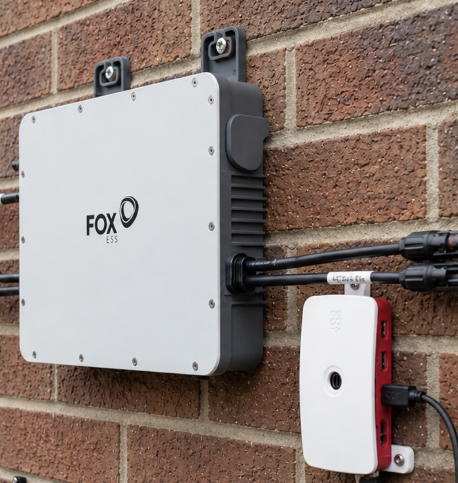

# FoxESS M1/Q1 Local Gateway

A Raspberry Pi gateway for FoxESS M1 and Q1 microinverters. The WEG
SIW100G and FHE-MASTER microinverter families are also likely compatible:
their firmware contains the same platform identifiers, although they have not
yet been tested with this gateway.
Provisions inverters directly over Bluetooth, decodes their local
telemetry, and publishes it to MQTT with Home Assistant auto-discovery —
the FoxESS app and cloud are not needed at any point.


## Why Use This

- Writable M1 `Active Power Limit` slider in Home Assistant for curtailment
  during negative electricity prices or demand-charge avoidance (German
  Nulleinspeisung); requires verified M1 firmware 1.80 or newer. Q1 control is
  intentionally unavailable until its separate firmware track is validated.
- No data leaves your network, including during initial setup — the Pi can
  provision the inverter directly over Bluetooth, so the FoxCloud mobile
  app is optional.
- Continue using your inverter even if the FoxESS cloud changes, is offline or gets disabled.
- Optional relay mode to the Fox ESS cloud is supported.
- MQTT auto discovery creates Home Assistant sensors automatically, neatly bundled into one
  device per inverter.
- No Home Assistant HACS Add-ons needed
- Works with multiple inverters connected through the Pi AP at the same time, even if they use
  their own mesh network.



## What This Does

The Raspberry Pi runs four pieces:

- `hostapd`/`dnsmasq` for an inverter-only Wi-Fi AP.
- A narrow nftables redirect for TCP/14431 traffic from the inverter AP subnet.
- `foxess-local-cloud`, a Python daemon that decodes the inverter's pushed
  telemetry, publishes MQTT state, and (when *Inverter Control* is enabled)
  drives the writable `Active Power Limit` slider directly over local
  Modbus, bypassing the FoxESS cloud.
- `foxess-ble-provision`, a Bluetooth tool that points inverters at the AP
  during setup, so the FoxESS mobile app isn't needed.

## Screenshots


## What You need
- A Raspberry Pi in range of your inverter(s) and your home Wi-Fi. A **Pi Zero W
  or Zero 2 W is recommended** — their Wi-Fi is 2.4 GHz-only, the same band the
  inverters use, so the one radio always shares 2.4 GHz between your home network
  and the inverter AP and setup just works. Newer dual-band models (3B+/4/5) also
  work, but the Pi's home Wi-Fi must be on the 2.4 GHz band — otherwise use a
  network cable for the Pi's internet.
- A recent wifi-only Fox ESS Solar inverter (also works with those connected to the Solakon Cloud), e.g.
  - M1-600-E
  - M1-800-E
  - M1-1000-E
  - M1-1200-E
  - Q1-1600-E
  - Q1-2000-E
  - Q1-2400-E
  - Q1-2500-E
  - Likely: WEG SIW100G M006/M008/M010/M012 W00 and FHE-MASTER
    600/800/1000/1200 (community testing wanted)
- Home Assistant with the Mosquitto Broker app

## Tested

Tested:

- Raspberry Pi Zero W running Raspberry Pi OS Lite (Trixie or Bookworm).
- FoxESS microinverters: M1-800-E (two PV strings) and Q1-2000-E
  (four PV strings, PV1–PV4).
- Decoded telemetry (both models):
  - PV power, voltage, and current per string.
  - AC power, voltage, current, and frequency.
  - Inverter temperature.
  - Lifetime generation and lifetime grid export.
  - Operating state (running/idle/fault). M1 models also have a fault state
    with the last fault's code, message, and timestamp.
  - Firmware and hardware versions decoded from the module-info frame.
  - Mesh role (root or follower) and — for followers — the root
    inverter's serial, derived from the periodic role-declaration
    frames the firmware emits.
- Provisioning a never-commissioned inverter onto the gateway over
  Bluetooth, without the FoxESS app — confirmed on the Q1-2000-E by a
  community user.
- MQTT retain and Home Assistant MQTT discovery.
- Optional cloud relay mode while still decoding local telemetry.
- Local control: writable M1 `Active Power Limit` HA entity and Modbus access
  (see *Inverter Control* in the runbook). It requires verified M1 firmware
  1.80 or newer. Q1 control remains unavailable pending validation.

Not yet tested (please let me know if you were able to test it):

- Newer FoxESS single-phase **hybrid** inverters (battery-equipped models in
  the same single-phase family as the M1/Q1). The transport layer should be
  the same, so they may work for the existing fields out of the box, but the
  battery-related telemetry fields aren't decoded yet. **If you own one,
  please try it and send a journald log (`sudo journalctl -u
  foxess-local-cloud.service > foxess.log`)** so we can extend the decoder.
- Other FoxESS inverter families (three-phase, AIO, EVO etc. — likely
  won't work without separate protocol work).
- WEG SIW100G and FHE-MASTER rebrands. Their names and matching M1 platform
  identifiers are embedded in the captured FoxESS firmware, so support is
  likely, but this has not yet been confirmed on physical hardware.

## Home Assistant Prerequisites

- Install the Home Assistant [Mosquitto Broker app](https://www.home-assistant.io/integrations/mqtt/)
- Create additional mqtt credentials in Mosquitto for this gateway (to be used during the install described below)
- Note your MQTT broker IP address or host name.

## Install On Raspberry Pi

Start with Raspberry Pi OS Lite (Trixie or Bookworm). Configure normal Wi-Fi and SSH using Raspberry
Pi Imager, then ssh into the pi and clone this repository:

```bash
git clone https://github.com/040medien/foxess_local_gateway
cd foxess_local_gateway
```

Then run:

```bash
sudo ./installer/install_pi_zero_gateway.sh \
  --ap-ssid FoxESS-Local \
  --mqtt-host mqtt-broker.local \
  --mqtt-username foxess \
  --mqtt-password 'your-mqtt-password'
```

If `--ap-passphrase` is omitted, the installer generates a random 32-character
Wi-Fi passphrase for the inverter-facing wifi and stores it in:

```text
/etc/foxess-local-cloud/wifi-credentials.txt
```

The installer prints the passphrase every time it runs.

Useful options:

```text
--ap-passphrase PASSPHRASE
--ap-channel 6
--mqtt-host HOST
--mqtt-username USER
--mqtt-password PASS
--no-mqtt
--relay
--no-relay
--foxess-cloud-ip IP
--foxess-cloud-host HOST
--dry-run
```

Fresh installs keep cloud relay disabled. With relay disabled, telemetry remains
local. When installed with `--relay`, the gateway forwards the decrypted session 
to FoxESS Cloud while still publishing MQTT locally.

The redirect is intentionally broad within the inverter AP: any AP client
connection to TCP/14431 is sent to the local daemon. That avoids depending on a
fixed FoxESS cloud IP or DNS answer, while still leaving the rule scoped to the
isolated inverter Wi-Fi subnet and the FoxESS telemetry port.

## Connect An Inverter

The installer offers to provision inverters over Bluetooth at the end of
the install. You can also run the same flow any time later:

```bash
sudo foxess-ble-provision
```

This drops into an interactive loop: it scans for nearby M1/Q1 inverters,
shows them with their signal strength, and lets you pick which one(s)
to provision. The Pi's AP credentials are loaded automatically from
`/etc/foxess-local-cloud/wifi-credentials.txt`. The loop stays running
until you press Enter to quit, so you can provision several inverters
in one session.

Other useful invocations:

```bash
sudo foxess-ble-provision scan                            # list nearby M1/Q1 inverters
sudo foxess-ble-provision networks AA:BB:CC:DD:EE:FF      # show WiFi networks visible to that inverter (read-only)
sudo foxess-ble-provision provision <mac> --yes           # one-shot, scripted
```

If the BLE link drops mid-flow, run it again — the inverter aggressively
closes idle BLE connections and may take 1–2 retries before a session
survives long enough to complete the handshake.

### Fallback: configure via the FoxCloud mobile app

If the Bluetooth path doesn't work for your setup, the FoxCloud app's
normal Wi-Fi configuration flow can also point the inverter at the Pi
AP. For a brand-new, never-cloud-paired inverter, the project has not
yet validated a fully cloud-free first commissioning end-to-end; if
yours requires the app to do its initial association, complete that
first with Cloud Relay enabled (see below), then switch the inverter
to the Pi AP using either the Bluetooth flow or the app.

## Home Assistant

The gateway publishes Home Assistant MQTT discovery configs after the first
telemetry frame from each inverter serial.

Example topics:

```text
foxess_m1/<serial>/state
foxess_m1/<serial>/0/power
foxess_m1/<serial>/0/ac/power
foxess_m1/<serial>/0/ac/export_power
foxess_m1/<serial>/0/ac/voltage
foxess_m1/<serial>/0/temperature
foxess_m1/<serial>/1/power
foxess_m1/<serial>/2/power
```

To change the friendly device names, edit:

```text
/etc/foxess-local-cloud/config.json
```

Example:

```json
{
  "devices": {
    "YOUR_INVERTER_SERIAL": "PV Inverter"
  }
}
```

Then restart:

```bash
sudo systemctl restart foxess-local-cloud
```

### Connectivity And Stale Data

Home Assistant also discovers a separate **FoxESS Local Gateway / Connected**
diagnostic entity. It follows the retained `foxess_m1/status` MQTT topic: it
turns off when the daemon disconnects unexpectedly and on again after it has
reconnected to the broker.

Each inverter has a **Telemetry Connected** diagnostic entity. It is on while
recent telemetry is arriving and turns off after five minutes without a frame.
This is distinct from a gateway crash: if the daemon itself is offline, the
entity becomes unavailable instead. The normal inverter sensors use the same
per-inverter availability state, so they do not silently retain a stale value.

For an automation that depends on generation data, require both diagnostic
entities to be on; treat off or unavailable as "do not act". The five-minute
freshness timeout is configurable in `/etc/foxess-local-cloud/config.json`:

```json
{
  "mqtt": {
    "telemetry_stale_after_seconds": 300
  }
}
```

Set it to `0` to disable the explicit per-inverter stale-data state. It is
separate from `expire_after_seconds`, which expires individual MQTT sensor
values.

## Status And Logs

```bash
sudo foxess-gateway-status
systemctl status foxess-pi-ap foxess-hostapd foxess-local-cloud
journalctl -u foxess-local-cloud -n 100 --no-pager
tail -f /var/log/foxess-local-cloud/events.jsonl
```

Expected daemon events:

```text
listen
connect
registration
bootstrap_ack
module_info
product_info
telemetry
mqtt_connected
telemetry_stale
telemetry_resumed
```

The installed daemon is supervised by systemd. It restarts after a crash and
also sends a 90-second systemd watchdog heartbeat once its TLS listener is
ready; a blocked asyncio event loop is therefore restarted automatically.

## Configuration

Main config:

```text
/etc/foxess-local-cloud/config.json
```

AP/redirect config:

```text
/etc/foxess-local-cloud/pi-ap.conf
```

Generated cert/key:

```text
/var/lib/foxess-local-cloud/
```

Logs:

```text
/var/log/foxess-local-cloud/events.jsonl
```

## Cloud Relay

Relay mode is optional.

Use relay mode when you want the FoxESS Cloud/app to keep receiving data while
you validate the local gateway:

```bash
sudo ./installer/install_pi_zero_gateway.sh --relay
```

Disable it for local-only operation:

```bash
sudo ./installer/install_pi_zero_gateway.sh --no-relay
```

## Firmware Version And Upgrades

The local `Active Power Limit` control is verified for **M1 firmware 1.80 or
newer**. It is confirmed unavailable on M1 1.66; on M1 1.77, writes can be
acknowledged without taking effect and diagnostic readback requests time out.
It is confirmed available on M1 1.80. The current version appears in
the Home Assistant device information
and in the gateway's `product_info` log event. The gateway only publishes the
Home Assistant slider and subscribes to its command topic after an M1 reports
a parseable version of 1.80 or newer. Older or unknown M1 versions have any
retained `Active Power Limit` discovery entities removed automatically.

Q1 uses a different firmware-version sequence. Its `Active Power Limit`
support has not been validated, so the gateway deliberately keeps the slider
and its command topic unavailable for every Q1 firmware version. Do not use
the M1 1.80 threshold to judge whether a Q1 update is current.

The percentage is relative to the inverter's rated maximum AC output, not its
current solar input. For example, a 20% limit on an M1-800-E is an approximate
160 W output ceiling. The limit only becomes visible when the available solar
power would otherwise exceed that ceiling. In a mesh installation, the
percentage and resulting ceiling apply separately to each inverter.

FoxESS makes firmware updates available through a FoxCloud 2.0 installer
account. The exact versions offered depend on the account, region, and device:

1. In FoxCloud 2.0, create an account and select **Installer & Admin** (older
   app versions label this **I am an installer/distributor**). Create or join
   your installer organisation.
2. Add the plant/device by scanning its QR code or entering its serial number.
3. Open **Device**, select the inverter, open its serial-number detail page,
   then select **Version**.
4. Select the offered firmware, choose **Upgrade Now**, and keep the inverter
   powered and online until the operation finishes.

For an M1 root/follower installation, upgrade every inverter and verify that
each reports 1.80 or newer. Then fully power-cycle the complete pair before
testing `Active Power Limit`. An M1-800-E/M10200 pair accepted and read back
limits after upgrading to 1.80 but did not apply them until this post-upgrade
power cycle.

These steps follow the official [FoxCloud 2.0 App User
Manual](https://www.fox-ess.com/Public/Uploads/uploadfile/files/20260212/ENFoxCloud2.0AppUserManual.pdf).
FoxESS is rolling app-based firmware upgrades out by product, so contact your
installer or FoxESS support if no version is offered for an M1/Q1 device.

The gateway also has research tools to capture a cloud-supplied firmware image
without installing it, and to install a previously captured, hash-verified
image later. These are intentionally separate from normal operation; see
[the firmware research and recovery section](LOCAL_CLOUD_PI.md#firmware-capture-and-local-upgrade).

## FAQ

### Why does this work?

The inverter's communication with FoxESS Cloud is TLS-encrypted, but the
inverter does not validate the server certificate. That means it accepts
any cert, including a self-signed one we generate locally. The Pi
presents its own cert with the same subject as the FoxESS cloud cert
(`CN=monitor`), terminates the TLS session, decodes the binary
telemetry, and (in relay mode) re-encrypts and forwards to FoxESS Cloud.

Interestingly, the *official* FoxESS Cloud cert is itself self-signed —
same `CN=monitor` subject, valid for 100 years, identical across all
known FoxESS upstream IPs. There is no PKI for the inverter to validate
against in the first place. The relay leg pins that cert by SHA-256
fingerprint to detect substitution on the Pi → cloud path.

The binary protocol itself was reverse-engineered by capturing the
cleartext stream and correlating fields with what the FoxESS app and
Modbus implementations expose. A handful of register offsets in each
238-byte telemetry frame still don't have confirmed semantics — they
are logged as `raw_u16_*` so they can be investigated as inverters
accumulate more lifetime energy or hit error states.

### Is the decoded data complete?

**For M1 and Q1 inverters: yes.** Every field a regular owner cares about is
decoded and published as a Home Assistant sensor: PV power, voltage,
and current per string; AC power, voltage, current, and frequency;
inverter temperature; operating state; lifetime generation and
lifetime grid export; firmware and hardware versions; mesh role for
multi-inverter setups. M1 models also expose current fault state with the last
fault's code, human-readable message, and timestamp. Those messages come from
an embedded copy of the FoxESS M/Q-series service manual table, so no internet
lookup is needed.

A handful of bytes in the 238-byte push frame still don't have
confirmed semantics and are logged as `raw_u16_*` for future
investigation, but none of them carry data a Home Assistant user
needs day to day.

Q1 four-string PV (PV3/PV4) decoding and the out-of-box Bluetooth
commissioning flow are validated on Q1-2000-E hardware. Q1 firmware 1.22 uses
the telemetry words that carry M1 AC-fault history for changing non-fault
values, so the gateway deliberately does not expose fault entities for Q1
until that model's fault layout is confirmed. The raw words remain available
in the event log for investigation.

### Will I lose access to the FoxESS app?

Only if you want to. With `--relay` enabled (the daemon's relay mode),
every frame is decoded locally *and* re-encrypted and forwarded to
FoxESS Cloud, so the FoxESS app keeps working exactly as
before — you just get local MQTT data on top. With `--no-relay`, the
cloud stops receiving data and the app loses access. You can flip
between the two by re-running the installer with the corresponding
flag.

### Can it read the inverter over Bluetooth instead of Wi-Fi?

No. Bluetooth is only used once — to point the inverter at the Pi's
Wi-Fi network (see the provisioning tool above). Live readings only ever
travel over Wi-Fi: the inverter pushes a fresh telemetry frame about
every 90 seconds, and only over its Wi-Fi link. Over Bluetooth it will
answer a direct request for a small block of stored values, but those do
not change while the inverter runs — they carry no live readings. This
was tested directly — holding a Bluetooth connection open for several
minutes, well past the 90-second mark, produced no live data — so Wi-Fi
is the only source of live readings.

### How do multiple inverters share the AP?

FoxESS microinverters form their own private mesh network — documented
in the manuals as "WIFI direct connection / Mesh networking
communication", and visible on the wire here. Only one inverter (the
**mesh root**) actually associates to the Pi's Wi-Fi AP and holds the
single DHCP lease. Every other inverter tunnels its telemetry through
the root over an inverter-to-inverter mesh link, and from the daemon's
perspective these arrive as multiple TCP sessions from the same source
IP and MAC, each with its own bootstrap and serial.

The mesh role can shift if the current root loses signal — you may
briefly see a second AP association during reformation, then it
settles back to one.

### Why a separate Wi-Fi AP rather than redirecting on my main network?

Scoping. The nftables redirect only matches AP-side traffic, the
inverter sits on its own SSID with `ap_isolate=1` so it can't reach
anything else on your LAN, and nothing on your main network ever sees
the cloud-impersonation cert. If you have an OpenWRT router or a
managed switch with policy routing, you could in principle achieve the
same thing on your main network with PBR + DNAT — the Pi setup just
bundles it all in one cheap device that's easy to reason about.

### Will it run in Docker or as a Home Assistant add-on?

The service code (`foxess_local_cloud`) is plain Python and will run
anywhere Python 3.10+ runs, including a container or HA add-on. The
catch is the **redirect** layer: the inverter wants to connect to a
FoxESS cloud IP on TCP/14431, so something on your network has to
intercept that traffic and route it to the daemon.

This project handles that on a Raspberry Pi by creating an isolated
Wi-Fi AP for the inverter and using nftables to redirect AP-side
TCP/14431 to the local daemon. If you run the daemon elsewhere, you
would have to provide the redirect yourself — for example with an
OpenWRT router (policy-based routing plus DNAT) or a managed switch
with VLAN/policy routing. There is no plug-and-play HA add-on path
today.

### Could this run on ESP32 / ESPHome instead of a Pi?

In principle yes, but it would need a custom ESPHome component
rather than a YAML-only port. The real obstacle is that the gateway
has to act as a TLS server with its own self-signed cert, which
isn't something ESPHome can do out of the box. The binary frame
decoder is small enough to port to C++, and MQTT and Home Assistant
discovery are easy in ESPHome.

One thing worth noting: on an ESP32 the Wi-Fi client and the
inverter access point have to use the same channel. That sounds
like a downside, but the Pi Zero W has only one radio too, so its
access point also has to sit on whatever channel your home Wi-Fi
is using. Both options share that constraint.

### Can I change other inverter settings from Home Assistant?

No — only `Active Power Limit`. The FoxESS installer portal also
exposes grid-protection thresholds, reactive-power modes, and the
country/grid-code preset, but those are regulatory settings that
should only be touched by a certified installer in coordination
with your grid operator. If you need one changed, ask your
installer to do it via the FoxESS portal.

M1 `Active Power Limit` requires verified M1 firmware 1.80 or newer. If the
slider's write is acknowledged but the output does not change, check the
reported firmware version first. After upgrading an M1 root/follower pair,
verify that both units report 1.80 or newer and fully power-cycle the pair
before investigating the Modbus exchange. Q1 local control remains disabled
until its distinct firmware track has been validated.

### Can the gateway update telemetry faster than ~90 seconds?

No. We mapped the inverter's full Modbus surface looking for a
live-data register block and didn't find one — the only readable
window the inverter exposes is a snapshot it refreshes when it
boots, not when you ask. The ~90-second push frame the inverter
sends on its own is the fastest live data available, and that's
what Home Assistant gets.

## Changelog

Dated, newest first. Only user-facing changes are listed — for the full
history including refactors and internal scaffolding, see the git log.

### 2026-08-30

- **Power-limit firmware support is now model-specific.** The M1 1.80
  requirement is verified only for M1 firmware. Q1 uses separate version
  numbers, so its `Active Power Limit` control remains safely unavailable
  until tested rather than applying an M1 version threshold.
- **Q1 false fault reports are suppressed.** Q1 firmware 1.22 sends changing
  non-fault values in the telemetry words used for M1 AC-fault history. The
  gateway now keeps those raw diagnostic values in the event log but removes
  the misleading Q1 fault entities from Home Assistant until the Q1 fault
  layout is confirmed.

### 2026-08-25

- **Gateway and stale-data monitoring.** Home Assistant now gets a separate
  gateway-connectivity diagnostic entity plus a `Telemetry Connected` entity
  for every inverter. Missing telemetry explicitly marks that inverter
  unavailable after five minutes, while systemd restarts a crashed or hung
  daemon automatically.

### 2026-08-03

- **Post-upgrade power cycling is documented.** A tested M1-800-E/M10200
  root/follower pair stored `Active Power Limit` values on firmware 1.80 but
  did not apply them until both inverters were fully power-cycled. The firmware
  guidance now also records the observed 1.77 acknowledgement/readback
  behaviour.

### 2026-07-16

- **Power-limit percentages are clarified.** `Active Power Limit` is relative
  to each inverter's rated maximum AC output, not its current solar input; for
  example, 20% on an M1-800-E is an approximate 160 W ceiling.

### 2026-07-15

- **Power-limit controls are firmware-gated.** The Home Assistant `Active
  Power Limit` slider and its MQTT command handler are exposed only after the
  inverter reports firmware 1.80 or newer. Older or unparseable versions also
  clear retained discovery left by a previous supported firmware session.
- **Firmware capture and controlled local upgrades.** An opt-in relay mode can
  intercept a FoxCloud firmware push, save the verified binary and manifest,
  and simulate acknowledgements/progress without passing the update to the
  inverter. It preserves the official cloud filename and records the observed
  transfer dialect. A separate root-only command can later upload a captured
  image to a connected inverter and normally requires its official SHA-256
  hash. Mesh upgrades are verified after reboot because a follower can finish
  an internally handed-off upgrade even when the local command times out.
- **Firmware compatibility is documented.** Local `Active Power Limit` now
  explicitly requires firmware 1.80 or newer, with minimal official FoxCloud
  2.0 installer upgrade steps. WEG SIW100G and FHE-MASTER models are listed as
  likely, but not yet physically tested, compatible M1-family rebrands.

### 2026-07-13

- **More power-limit diagnostics are logged.** After the inverter acknowledges
  a local `Active Power Limit` write, the gateway now reads register `0xCA5A`
  on the same session and adds an `active_power_limit_readback_result` log line
  with the requested and actual values, inverter model/firmware/mesh role when
  known, and a precise outcome (`matched`, `mismatch`, `timeout`,
  `no_connection`, or `error`). Explicit Modbus rejections include their
  exception code. These extra logs help diagnose why an acknowledged limit
  does not take effect; they do not change control or retry behaviour and do
  not yet attempt a firmware-specific fix.
  ([#54](https://github.com/040medien/foxess_local_gateway/issues/54))
- **AC fault codes are decoded generically.** The gateway now interprets the
  inverter's four recent-fault slots as the bitmasks they actually contain,
  covering every documented M/Q-series AC failure without adding one-off raw
  value mappings. Mixed and changing faults update `Last Fault` to the newest
  snapshot while repeated entries do not create duplicate transitions. This
  also resolves the `raw:2106-106-104-04` report as `4158` — AC Under Voltage.
  Faults signalled only by the separate, not-yet-decoded offset-98 word are
  retained as a stable raw code instead of leaving the previous AC fault in
  place.
  ([#52](https://github.com/040medien/foxess_local_gateway/issues/52))

### 2026-07-11

- **FoxCloud `Active Power Limit` changes update MQTT state.** When the FoxESS
  cloud writes the `Active Power Limit` register while the gateway is relaying,
  the Home Assistant/MQTT Number state now follows that observed value instead
  of waiting for a later readback or local setpoint.

### 2026-07-10

- **`Active Power Limit` accepts short write acknowledgements.** Some inverter
  firmware answers a local `Active Power Limit` write with a short `01 06`
  acknowledgement instead of the full Modbus write echo. That now counts as
  `confirmed` when it matches one of our injected writes; real Modbus
  exceptions still report `rejected`.

### 2026-06-28

- **TCP keepalive on the inverter connection.** The daemon now enables TCP
  keepalive (default 30 s idle, configurable via
  `inverter_tcp_keepalive_seconds`, 0 disables) on the inverter's connection, so
  a marginal Wi-Fi link is kept warm and a dropped session is detected within
  about a minute — which lets the `Active Power Limit` retry-on-reconnect kick in
  promptly instead of waiting on a silently-dead socket.
- **`Active Power Limit` setpoints survive a dropped connection.** If a setpoint
  can't be confirmed right now — typically because the inverter dropped its
  session on a weak link — the daemon remembers it and re-applies it once the
  inverter reconnects and settles, so curtailment is self-healing instead of
  silently lost. The latest setpoint always wins, and a confirmed write clears
  the pending state so it isn't re-sent on every reconnect. (Towards #43.)
- **`Active Power Limit` writes are now confirmed.** Instead of fire-and-forget,
  the daemon waits for the inverter's Modbus acknowledgement (round-trip is
  ~0.3 s on a healthy link) and reports the outcome on
  `foxess_m1/<serial>/active_power_limit/result` (`confirmed` / `rejected` /
  `timeout` / `no_connection` / `error`), surfaced as an `Active Power Limit
  Result` diagnostic sensor. Only a genuine write acknowledgement counts as
  `confirmed` — a Modbus exception/NAK is reported as `rejected`, and a command
  sent while the inverter has dropped its session reports `no_connection`. The
  setpoint state is only updated on a confirmed write, so an unconfirmed command
  no longer looks applied — useful when driving curtailment (e.g.
  Nulleinspeisung) from your own fast power source.
  Timeout is configurable via `inverter_control.write_timeout_seconds`
  (default 3 s). (Towards #43.)
- **AP is now kept on 2.4 GHz, with a regulatory country code.** FoxESS
  inverters are 2.4 GHz-only, and a single-radio Pi shares one channel between
  the home Wi-Fi and the inverter AP. The installer now rejects a 5 GHz AP
  channel with clear guidance instead of building an AP the inverter can't join,
  adds a `country_code` (new `--ap-country`, auto-detected from the system
  regdomain) so channels 12/13 work, and `foxess-pi-ap` warns if the home Wi-Fi
  is on 5 GHz. A **Pi Zero W / Zero 2 W** (2.4 GHz-only radio) is now the
  recommended hardware because it sidesteps the band mismatch entirely.
- **AP interface now gets its own MAC address when it needs one.** On some
  Raspberry Pi Wi-Fi chips the access-point interface (`ap0`) came up sharing
  the station interface's MAC, and hostapd failed to start with
  `Could not set interface ap0 flags (UP): Name not unique on network`.
  The AP setup now detects that collision and assigns `ap0` a distinct,
  locally-administered MAC derived from `wlan0` before bringing it up, so
  concurrent Wi-Fi + AP works on those boards too. Chips that already give
  `ap0` a distinct MAC are left untouched, so existing gateways keep their
  AP BSSID and provisioned inverters do not have to re-associate. (Fixes #39.)
- **MQTT defaults tuned for the ~90 s telemetry cadence.** `retain` now
  defaults to on, so the last reading survives in the broker and Home
  Assistant entities keep their value across HA restarts instead of
  showing nothing until the next push. `expire_after_seconds` now
  defaults to 300 (was 180) so normal timing jitter no longer briefly
  flaps entities to "unavailable" — they still go unavailable if the
  inverter is genuinely offline. Both stay overridable in the config.

### 2026-06-26

- **Q1-2000-E now provisions and reports over Bluetooth.** A
  never-commissioned Q1-2000-E sends a registration frame that differs
  from the M1's in a single byte, which made `foxess-ble-provision` reject
  it with "first frame not a registration". That registration variant is
  now accepted, so the Q1 provisions onto the gateway Wi-Fi and streams
  its full four-string PV telemetry. Thanks to the community report that
  pinpointed the difference. (Confirmed on a real Q1-2000-E.)
- **Inverter model name no longer shows stray control characters.** Some
  inverters prefix the model string with a non-printable byte (the Q1
  reported its model as `\x01Q1-E`); the name is now cleaned to plain text
  (`Q1-E`) before it reaches MQTT and Home Assistant.
- **Clearer diagnostics for unrecognised inverters.** When provisioning
  rejects the first frame, the error now includes the leading payload
  bytes alongside the function code, so a new model with yet another
  registration variant can be identified from a single log line.

### 2026-06-14

- **Confirmed there is no way to get live readings over Bluetooth.**
  Bluetooth answers a request for a small block of stored values, but
  those do not change while the inverter runs, and the ~90-second live
  telemetry is only ever sent over Wi-Fi — verified by holding a
  Bluetooth connection open well past the 90-second mark with no live
  data. See the FAQ. Wi-Fi remains the only source of live telemetry.
- **Faster redeploys when only the daemon code changed.** The installer
  gained an `--app-only` option that updates the gateway software and
  restarts it in a couple of seconds, without touching the inverter Wi-Fi,
  the network redirect, or your saved settings. The full installer is still
  used for first-time setup and any change to the Wi-Fi or network setup.
- **"AC Under Voltage" faults now show their name.** When the grid
  voltage drops too low (seen here after the inverter's input cables
  were unplugged and replugged), the fault used to appear as an
  unrecognised raw code. It now reads as "AC Under Voltage", matched to
  the same name the FoxESS app shows, and keeps that name for the whole
  fault rather than only the first moment. Any fault that still isn't
  recognised is now clearly flagged in the logs so it can be added.

### 2026-06-13

- **Sensors recover on their own after a broker hiccup.** Previously,
  if the connection to the MQTT broker dropped in a certain way (for
  example after a reboot, or when Home Assistant restarted), the
  gateway could stay quietly connected but stop sending updates, so
  the sensors froze on stale values until the gateway was restarted by
  hand. The gateway now checks its own broker connection in the
  background and re-establishes it automatically, so sensors resume
  updating without intervention. The check interval is configurable
  via `mqtt.health_check_interval_seconds` (default 30 s; set to 0 to
  disable).

### 2026-06-11

- **Writable `Active Power Limit` via MQTT.** Home Assistant gets a
  writable `Active Power Limit` Number entity (0–100 %, 1 % step)
  that goes straight to the inverter as a Modbus write — no FoxESS
  cloud round-trip and no installer account needed. The daemon also
  reads the current value once on the first telemetry frame so HA
  shows the live setpoint as soon as the inverter is producing. The
  write response is stripped from the upstream stream so FoxCloud
  sees no extra traffic. Enabled by default; pass
  `--disable-inverter-control` to the installer to turn it off.
- **Investigated local Modbus telemetry, deliberately not shipping
  it.** Comprehensive Modbus probing (every standard function code,
  all slave IDs, wide-band input + holding sweeps) confirmed the
  inverter has only one input-register window worth reading
  (`0x277E`, 28 registers) and that window is a slow snapshot
  refreshed only on inverter boot — values stay constant for hours
  across polls, writes, and session reconnects. No live-telemetry
  block exists in the Modbus surface, so faster-than-push polling
  isn't possible. The 90 s push frame remains the telemetry source.
- **Other installer-portal settings (`GridVoltageParameters`,
  `GridFreqParameters`, `PowerFreCon`, `ReactiveConfig`,
  `StartParameters`, `SafetyCountry`) are not exposed.** Same local
  Modbus channel could technically write them, but they're grid-code
  regulatory settings — touching them risks EN 50549 non-conformance,
  nuisance trips, and DSO contract issues. See *What we deliberately
  don't expose* above for the full rationale.

### 2026-06-09

- **Decode inverter → cloud Modbus read responses.** Reads issued by
  the cloud (`command_frame` with function 0x03 or 0x04) are now
  joined to their response on the way back: the daemon emits a
  `command_response` event with the decoded register values, joined
  by envelope device bytes to the original request so the response
  carries the target `address_hex` and `count` for context. Makes the
  read side of the setting protocol as readable as the write side.
- **Decode cloud → inverter Modbus command frames.** The FoxESS cloud
  pushes setting reads and writes as Modbus PDUs (function 0x03 read
  holding, 0x04 read input, 0x06 write single, 0x10 write multiple)
  wrapped in the `7f7f`/`f7f7` command envelope. The daemon now emits
  a structured `command_frame` log line for each, with `function_name`,
  `address_hex`, and either `value`/`count`/`values`. First confirmed
  register: ActivePowerLimit at `0xCA5A` (slave 1), value in percent.
- **Full payload hex on relay logs.** The `relay_decrypted` log line
  now includes `payload_hex` in both directions, not just byte length.
  Useful when reverse-engineering cloud → inverter command frames
  (e.g. ActivePowerLimit, work modes) that the parser does not yet
  decode and would otherwise pass through invisibly.

### 2026-06-07

- **BLE-based WiFi provisioning.** Point an inverter at the Pi's AP
  directly from the Pi over Bluetooth — no mobile app required. The
  installer offers an interactive multi-inverter flow at the end, and
  `sudo foxess-ble-provision` can be run any time afterwards.
- **Mesh topology sensors.** Each inverter now exposes its current
  role (`root` or `follower`) and the root's serial (when follower)
  as Home Assistant `Mesh Role` and `Mesh Peer Serial` sensors,
  derived live from the periodic role-declaration frames. Useful for
  understanding why the FoxESS cloud sometimes shows a follower as
  "offline" while it is in fact generating normally.
- README and runbook refresh covering the features added in PRs #7–#10
  (lifetime export, fault sensors, firmware/hardware versions, fault
  code table); ESP32/ESPHome FAQ rewritten in plainer language.

### 2026-06-06

- New sensor: **Last Fault Message** — human-readable description from
  an embedded copy of the FoxESS Q/M-series service-manual fault code
  table, so the entity reads `"PV1 voltage low"` instead of `0x102`.
- New sensors: **Last Fault Code** and **Last Fault Time** — track
  fault transitions, not just current state.
- New sensor: **Lifetime Grid Export** (`export_total_kwh`). Decoder
  also handles inverters wired with only one PV string.
- New sensors: **Firmware Version** and **Hardware Version**, decoded
  from the module-info frame and surfaced on the HA device card.
- MQTT keepalive raised to 180 s and reconnect backoff capped at 15 s
  to avoid spurious disconnects during long telemetry quiet periods.
- Relay mode falls back to local-only publishing when the upstream
  FoxESS cloud is unreachable, so MQTT keeps working through outages.
- FAQ section added, including a writeup of the inverter mesh networking
  (only one inverter associates to the AP; the others tunnel through it).
- Hostapd decoupled from the daemon (separate systemd unit) so the AP
  stays up across daemon restarts.
- FoxESS cloud certificate pinned by SHA-256 fingerprint on the relay
  leg; daemon listener scoped to the AP subnet; AP clients isolated
  from each other and from the LAN.
- Home Assistant availability handling fixed; duplicate feed-in sensor
  removed.

### 2026-06-05

- Inverter operating state (running / idle / fault) exposed as a
  binary sensor.
- Device names from `config.json` preserved across reinstall.

### 2026-06-04 — initial release

- TCP/14431 frame decoder for the FoxESS proprietary protocol.
- Home Assistant MQTT auto-discovery: PV power/voltage/current per
  string, AC power/voltage/current/frequency, inverter temperature,
  lifetime generation.
- Optional cloud relay mode while still decoding local telemetry.
- Pi Zero W installer: isolated inverter AP, nftables TCP/14431
  redirect (matches any AP-client connection, no dependence on a
  specific FoxESS cloud IP), and systemd services.

## Development

Run tests:

```bash
python3 -m unittest
```

Installer dry-run without touching the system:

```bash
./installer/install_pi_zero_gateway.sh \
  --dry-run \
  --preview-dir /tmp/foxess-preview \
  --skip-app-copy \
  --non-interactive
```

Redeploy only the daemon code to an already-installed Pi (skips the Wi-Fi AP
and config setup, restarts just the daemon — handy when iterating):

```bash
sudo ./installer/install_pi_zero_gateway.sh --app-only
```

## Uninstall

```bash
sudo ./installer/uninstall_pi_zero_gateway.sh
```

The uninstall script removes services, AP config, redirect setup, and the app
under `/opt`. It intentionally leaves config, generated certs, and logs under
`/etc`, `/var/lib`, and `/var/log` so you can inspect or reuse them.
